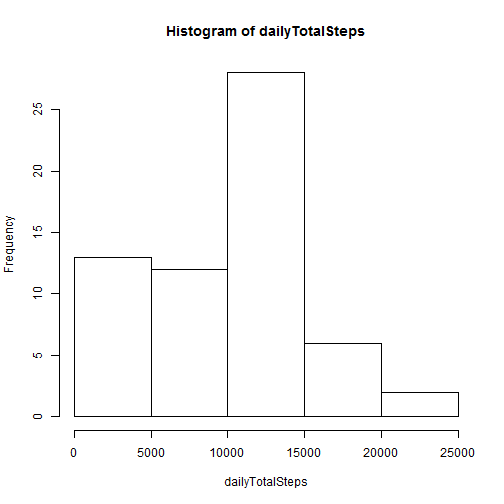
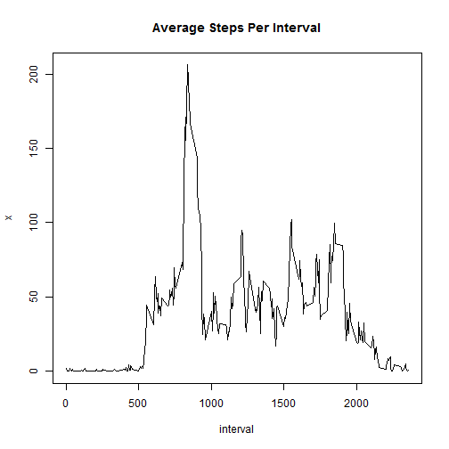
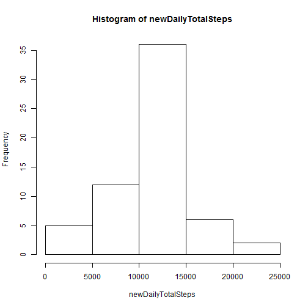
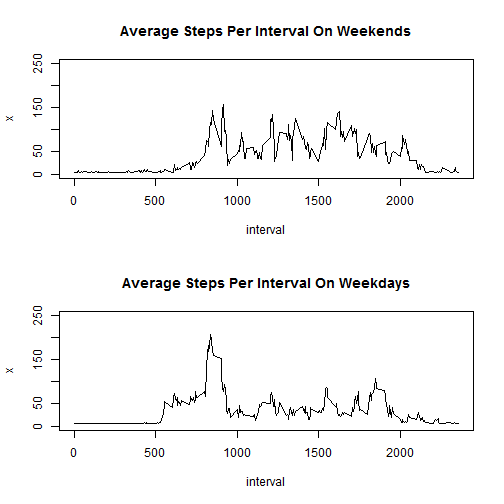

This is my report document for Peer Assessment 1 in the Reproducible Research
course.  In it, I provide answers, in the form and figures and data, to
the questions in the assignment.  I also include the R code that pro-
duces the answers.


## Loading and preprocessing the data
The data for analysis, from a personal activity monitoring device, are records
of steps taken (measured at 5-minute intervals) by an individual throughout
each day during the 61-day period covering October and November 2012.  The
raw data are in a zipped CSV file in the working directory.  They are
accessed and read via the following code:


```r
data1 <- read.csv(unz("activity.zip", "activity.csv"))
```


## What is mean total number of steps taken per day?
I begin my analysis by examining the shape and central tendency of the data
distribution.
First off, here is a histogram of the total number of steps taken each day,
ignoring missing values in the dataset:


```r
dailyTotalSteps <- tapply(data1$steps, data1$date, sum, na.rm = TRUE)
hist(dailyTotalSteps)
```

 

The daily sums of steps appear to center around the 10,000 steps per day level.
Here are the calculated mean and median for the 61 daily totals:


```r
mean(dailyTotalSteps)
```

```
## [1] 9354
```

```r
median(dailyTotalSteps)
```

```
## [1] 10395
```


## What is the average daily activity pattern?
By calculating the average number of steps taken across all 61 days in each
of the 288 interval measurements per day, we can examine the time series of
steps taken (on average) throughout the day.  I make that calculation and
plot the results with the following code:


```r
avgStepsPerInterval <- aggregate(data1$steps, list(interval = data1$interval),
        mean, na.rm = TRUE)
plot(avgStepsPerInterval, type = "l")
title(main = "Average Steps Per Interval")
```

 

The 5-minute interval with the maximum number of steps, averaged across all
61 days is 835, meaning 8:35 in the morning, with an average of 206.2 steps.
This probably reflects a flurry of activity to get to a workplace most mornings
and is calculated as follows:


```r
avgStepsPerInterval[which.max(avgStepsPerInterval$x),]
```

```
##     interval     x
## 104      835 206.2
```


## Imputing missing values
There are a total of 8 days in the 61-day dataset without values.  Here I
impute and fill in all these missing data.
First, I report the total number of missing values in the dataset.  This is
easily obtained from the summary() function:


```r
summary(data1)
```

```
##      steps               date          interval   
##  Min.   :  0.0   2012-10-01:  288   Min.   :   0  
##  1st Qu.:  0.0   2012-10-02:  288   1st Qu.: 589  
##  Median :  0.0   2012-10-03:  288   Median :1178  
##  Mean   : 37.4   2012-10-04:  288   Mean   :1178  
##  3rd Qu.: 12.0   2012-10-05:  288   3rd Qu.:1766  
##  Max.   :806.0   2012-10-06:  288   Max.   :2355  
##  NA's   :2304    (Other)   :15840
```

The function reports 2,304 rows with NA for the steps variable.

I fill in these missing values with the average number of steps measured over
all days and intervals that have reported values.  The following code calculates
that average, replaces all the NAs in the original data frame, data1, with that
value, and finally assigns the filled-in dataset to a new data frame, data2,
in preparation for further analysis.


```r
data1[is.na(data1)] <- mean(data1$steps,na.rm = TRUE)
data2 <- data1
```

I can run the summary() function on the new dataset, showing that there are
no longer any missing values:


```r
summary(data2)
```

```
##      steps               date          interval   
##  Min.   :  0.0   2012-10-01:  288   Min.   :   0  
##  1st Qu.:  0.0   2012-10-02:  288   1st Qu.: 589  
##  Median :  0.0   2012-10-03:  288   Median :1178  
##  Mean   : 37.4   2012-10-04:  288   Mean   :1178  
##  3rd Qu.: 37.4   2012-10-05:  288   3rd Qu.:1766  
##  Max.   :806.0   2012-10-06:  288   Max.   :2355  
##                  (Other)   :15840
```


Next I repeat the histogram displayed earlier in this report, this time based
on the revised dataset with no missing values.


```r
newDailyTotalSteps <- tapply(data2$steps, data2$date, sum)
hist(newDailyTotalSteps)
```

 

The histogram shows that the daily sums of steps are now more strongly and more
symmetrically centered in the 10,000 to 15,000 per day range.  This time, the
calculated mean and median for the 61 daily totals are equal:


```r
mean(newDailyTotalSteps)
```

```
## [1] 10766
```

```r
median(newDailyTotalSteps)
```

```
## [1] 10766
```

Replacing missing values with positive values resulted in the the mean and
median differing from the estimates in the first part of the assignment.  They
are now more centered and they are higher values, reflecting the increase in
total daily number of steps produced by replacing missing values with positive
values.

## Are there differences in activity patterns between weekdays and weekends?
Using the new filled-in dataset, I create a new factor variable with two
levels - weekend and weekday - and then use it to examine whether there are
differences between weekends and weekdays in the daily pattern of steps taken.
I do this be repeating the time series plot from earier in the assigment, once
for weekends and once for weekdays.


```r
# changing date variable to class date to enable use of weekdays() function
data2$date <- as.Date(data2$date)
# adding new variables for day of the week and then weekend day or weekday
data2["day"] <- 0
data2$day <- weekdays(data2$date)
data2["wkend"] <- 0
data2$wkend <- "weekday"
data2$wkend[data2$day == "Saturday" | data2$day == "Sunday"] <- "weekend"
wkendsub <- subset(data2, wkend=="weekend")
wkdaysub <- subset(data2, wkend=="weekday")
# calcuating time series of average steps per interval for weekend days
# and weekdays
wkendAvgSteps <- aggregate(wkendsub$steps, list(interval = wkendsub$interval),
     mean)
wkdayAvgSteps <- aggregate(wkdaysub$steps, list(interval = wkdaysub$interval),
     mean)
# plotting the two time series
n.row <- 2
n.col <- 1
par(mfcol = c(n.row,n.col))
plot(wkendAvgSteps,type = "l", ylim = c(0,250))
title(main = "Average Steps Per Interval On Weekends")
plot(wkdayAvgSteps,type = "l", ylim = c(0,250))
title(main = "Average Steps Per Interval On Weekdays")
```

 

Comparing the two plots, we can see that activity takes place a higher level
throughout the weekend days than it does during the weekdays.  The weekday
pattern is for an early peak in activity followed by a lower level of activity
for the rest of the day.  On the weekend days, however, the plot indicates a
somewhat higher level of activity continuing throughout much of the day.


